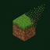

# World Cleanup

**Intelligent dropped-item cleanup that reduces lag without punishing players.**

> Official downloads are available only from [CurseForge](https://www.curseforge.com/minecraft/mc-mods/world-cleanup) and [Modrinth](https://modrinth.com/mod/world-cleanup). GitHub contains source code and documentation; release jars are not distributed here.

## What it does

World Cleanup replaces Minecraft's universal dropped-item timer with configurable rules that understand item value and context:

- Valuable items remain longer while common blocks disappear sooner.
- Player-thrown items and mob drops use separate timers.
- Items near a recent player death receive temporary protection.
- Dense farms can clean eligible drops more aggressively.
- Every timer, detection setting, and item category can be changed in-game.

## Compatibility

| Minecraft | Fabric | NeoForge |
| --- | :---: | :---: |
| 26.1.2 | ✓ | ✓ |
| 26.2 | ✓ | ✓ |

Fabric requires Fabric API. Mod Menu is recommended for its in-game configuration button.

## Installation

1. Install Fabric or NeoForge for a supported Minecraft version.
2. Download the matching World Cleanup jar from CurseForge or Modrinth.
3. Place it in the instance or server `mods` folder.

Configuration is stored in the normal Minecraft `config` folder and persists between launches.

## Source layout

The repository keeps one shared codebase:

- `common` — cleanup rules, classification, and tests
- `fabric` — Fabric integration and configuration screen
- `neoforge` — NeoForge integration and configuration screen

To build locally, run the Gradle wrapper inside either loader folder. Generated development jars are not official releases.

## License

World Cleanup is distributed under an [All Rights Reserved license](LICENSE). Viewing the source is permitted; copying, redistribution, and derivative works require prior written permission.
